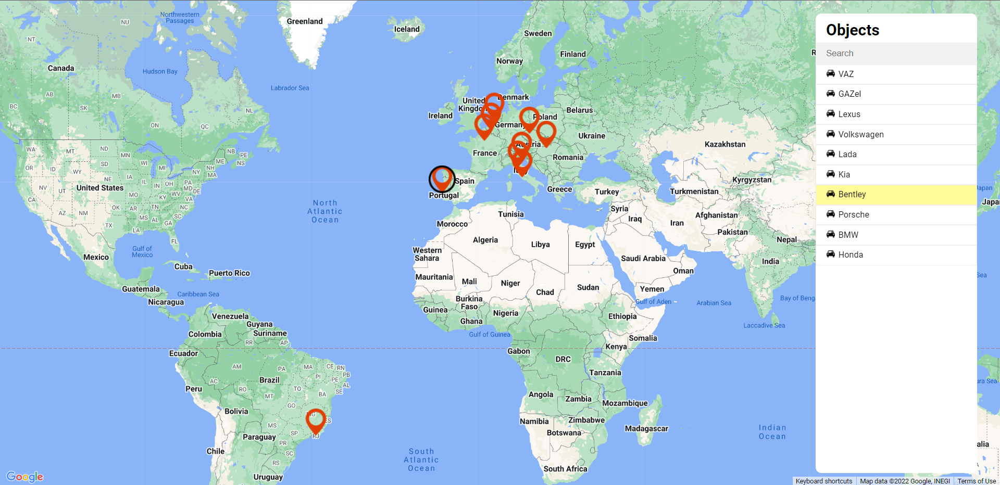

# Angular Google Map

## Description

This is an Angular Google Map application powered by an Angular framework and Angular Google Maps (AGM) that provides the main functions you'd expect from a web map application, such as map markers, filtering existing map markers by name, applying selection styling, etc.

## Screenshots

<!-- If you have screenshots you'd like to share, include them here. -->
## Features

- Ability to filtering existing map markers
- Applying selection styling
- Markers info hint (coordinates)
- Basic search input validation

## Usage

- Clone this repo to your desktop using `git clone` 
- Run `npm install` to install all the dependencies

## Running application

- Run `npm start` to launch application.
- You will then be able to access it at `localhost:4200`

## Further help

To get more help on the Angular CLI use `ng help` or go check out the [Angular CLI Overview and Command Reference](https://angular.io/cli) page.
